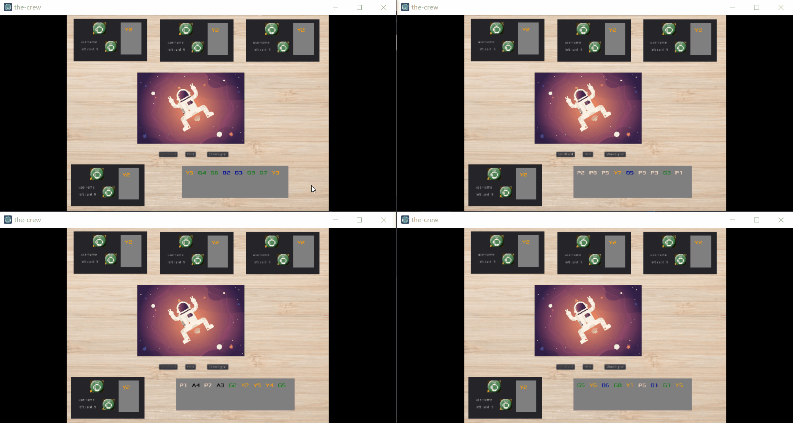
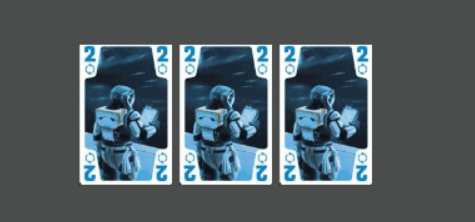

## The Crew

🤖采用godot引擎制作的《星际探险队：第九行星任务》桌游电子版，支持多人联机游玩。

联机大厅使用官方demo代码实现，目前实现的功能有：

- 自动发牌、创建游戏
- 出牌动作、胜负判断
- 多玩家联机，胜者出牌逻辑

后续将要进行的工作有：

- [ ] 玩家面板构建
- [ ] 游戏中给出信号动作相关逻辑
- [ ] 卡牌UI优化
- [ ] 船长token、信号token的UI优化
- [ ] 游戏内聊天框
- [ ] 智能游戏任务提醒
- [ ] 智能任务逻辑判断
- [ ] 更生动的用户交互

